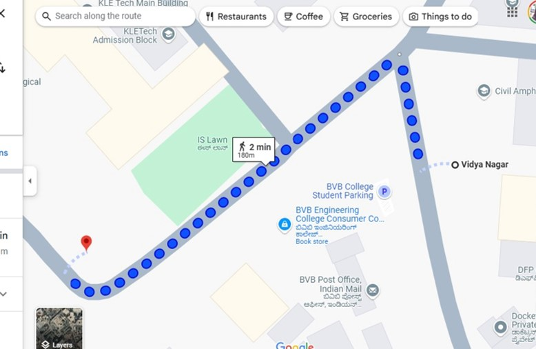
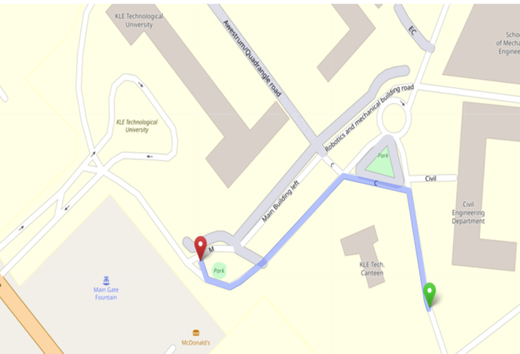

# 🚗 Path Planning for an Autonomous Vehicle  

  

## 🌍 Overview  
Autonomous vehicle navigation is transforming mobility by ensuring **efficient, safe, and optimized** path planning. This project focuses on developing a **heuristic-driven path planning algorithm** using A* (A-Star) Algorithm, combined with **Google Maps API & OpenStreetMap** for real-time route computation.  

The system integrates:  
✔ **Waypoint-based path optimization**  
✔ **Graph-based navigation using Haversine formula**  
✔ **Dynamic route adjustments in changing environments**  

---

## 🚀 Features  
✅ **Optimized pathfinding** using the A* algorithm  
✅ **Graph-based representation** for structured navigation  
✅ **Integration with Google Maps API & OpenStreetMap**  
✅ **Dynamic re-routing for real-time navigation**  
✅ **Supports multiple waypoints for efficient route planning**  

---

## 🛠️ Methodology  

### 🔹 Step 1: **Location Data Retrieval**  
- Fetch **real-time locations** using **Google Places API**  
- Extract **latitude and longitude** coordinates  

### 🔹 Step 2: **Graph Construction & Representation**  
- Convert locations into **graph nodes**  
- Calculate distances using the **Haversine formula**  
- Generate **edges between nodes** within a predefined radius  

### 🔹 Step 3: **Pathfinding Algorithm Implementation**  
- Utilize **A* Algorithm** for **shortest path computation**  
- Optimize route by prioritizing **low-cost paths**  
- Implement **real-time re-routing** capabilities  

### 🔹 Step 4: **Route Visualization & Display**  
- Display generated paths on **OpenStreetMap (OSM)**  
- Support **lane-level navigation accuracy**  
- Compare results between **Google Maps API & OSM**  

---

## 📌 Technologies Used  
| Technology | Purpose |
|------------|---------|
| **Python** 🐍 | Main programming language |
| **Google Maps API** 🌍 | Fetching map data & locations |
| **OpenStreetMap (OSM)** 🗺️ | High-precision mapping & visualization |
| **Haversine Formula** 📏 | Accurate distance calculation between coordinates |
| A* Algorithm 🧠 | Heuristic-based shortest pathfinding |

---

## 📈 Results  
📌 **87% accuracy** in real-world shortest pathfinding  
📌 **Lane-level precision** achieved by switching from Google Maps API to OpenStreetMap  
📌 **Graph-based path optimization** with real-time navigation support  

### 🗺️ **Route Visualization (Google Maps API vs OpenStreetMap)**  
| Google Maps API | OpenStreetMap |
|-----------------|---------------|
|  |  |

---

## 🔮 Future Enhancements  
🔹 **Real-time traffic data integration** for better route optimization 🚦  
🔹 **Hybrid approach combining A*, RRT, & Dijkstra** for **scalability** 🔄  
🔹 **Testing on autonomous vehicle hardware** for real-world performance 🚗💨  
🔹 **Weather & road condition-based route adjustments** 🌦️  

---

## 🏆 How to Run the Project  
1️⃣ Clone this repository:  
```bash
git clone https://github.com/your-username/path-planning-autonomous-vehicle.git
cd path-planning-autonomous-vehicle
